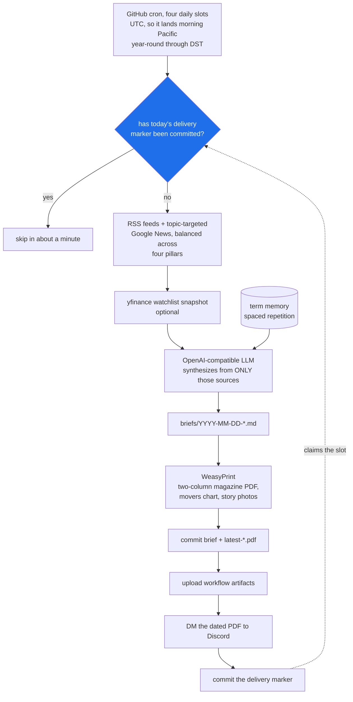

# Morning Brief 🗞️

A GitHub Actions bot that generates Laksh's **daily personal newspaper** - world affairs & geopolitics first, then markets/investing, AI & infrastructure, and new AI models/research - commits it to this repo, uploads it as a workflow artifact, and DMs the PDF to Discord.

Every morning (Pacific time) it:

1. Pulls current articles from credible RSS feeds + topic-targeted Google News searches, **balanced across four pillars** (world / markets / AI / research) so no single beat crowds the others out (no paid API, no hallucinated news).
2. Optionally snapshots watchlist quotes via `yfinance`.
3. Asks an **OpenAI-compatible LLM** to synthesize a structured Markdown brief from **only** those sources, teaching terms cumulatively (see [Term memory](#term-memory-spaced-repetition)).
4. Renders a **two-column magazine PDF** (WeasyPrint): masthead, a watchlist "biggest movers" chart, best-effort story photos, clickable links, and full-width tables.
5. Commits `briefs/YYYY-MM-DD-*.md` + `.pdf` and updates `briefs/latest-*.pdf`.
6. Uploads all outputs as workflow artifacts.
7. Sends the dated PDF to your Discord DM (or a channel).

## The run



Four cron slots fire every day rather than one, because GitHub's scheduler is
best-effort and the brief should still land if a slot is dropped. The committed
delivery marker is what stops that redundancy from mailing you the same paper
four times.

## Coverage (four equal pillars + light secondary beats)

- **World & Geopolitics** (lead) - wars, great-power relations (prioritizing **US–China, the Middle East, and India/South Asia**), diplomacy, big international deals, notable statements.
- **Markets, Money & Deals** - rates, macro, earnings, M&A, market milestones; a light crypto/fintech touch.
- **AI & Infrastructure** - labs, hyperscalers, data centers, GPUs, HBM, networking, power, and the semiconductor supply chain, through an investing lens.
- **Model & Research Watch** - new model launches (params, context, benchmarks, price), notable papers/findings, plus a short science/space note.

Secondary beats (US politics, defense/military tech, crypto, science/space) ride lightly inside the pillar they fit.

<a name="term-memory-spaced-repetition"></a>
## Term memory (spaced repetition)

Because the brief is read daily, terms are taught **cumulatively**. Each run reconstructs how many times every term has already been explained (from prior briefs' "Terms & Concepts" sections) and tells the model to:

- fully explain a term (definition + example + use case + rough numbers) for its first few appearances,
- then, once it's appeared enough times (`BRIEF_TERM_MASTERED_AFTER`, default 4), only **reference** it.

A short "Quick Check" quiz is appended every `BRIEF_QUIZ_EVERY` briefs (default every 2nd).

---

## Why GMI Cloud (zero extra billing)

The generator talks to any endpoint that speaks the **OpenAI Chat Completions API**. By default it points at **GMI Cloud** (`https://api.gmi-serving.com/v1`) with an open-weight model (`deepseek-ai/DeepSeek-V4-Flash`). Using your GMI key means an open-source model with essentially free/near-zero cost - no OpenAI or Anthropic billing required.

You can repoint it at OpenAI, or any other compatible provider, purely via env/variables (see below).

---

## Repo structure

```
morning-brief/
  README.md
  requirements.txt
  .gitignore
  .github/workflows/morning-brief.yml
  briefs/                 # generated .md / .pdf are committed here
  scripts/
    common.py             # shared paths, date, state
    generate_brief.py     # fetch sources -> LLM -> Markdown
    render_pdf.py          # Markdown -> PDF
    send_discord.py        # PDF -> Discord
```

---

## Required secrets

Configure these under **Settings → Secrets and variables → Actions → Secrets**:

| Secret | Purpose |
| --- | --- |
| `GMI_API_KEY` | GMI Cloud inference key (**recommended**). *Or* set `OPENAI_API_KEY` instead. |
| `DISCORD_BOT_TOKEN` | Discord **bot** token (from the Discord Developer Portal). |
| `DISCORD_TARGET` | Where to send. `user:YOUR_DISCORD_USER_ID` for a DM, or `channel:<channel_id>`. |

Optional **Variables** (Settings → Variables), to override defaults without touching code:

| Variable | Default | Notes |
| --- | --- | --- |
| `LLM_BASE_URL` | `https://api.gmi-serving.com/v1` | OpenAI-compatible base URL. |
| `LLM_MODEL` | `deepseek-ai/DeepSeek-V4-Flash` | Any model your endpoint serves. |

> **Which model?** List what your key can access:
> ```bash
> curl -s https://api.gmi-serving.com/v1/models -H "Authorization: Bearer $GMI_API_KEY" | python3 -m json.tool
> ```
> Then set the `LLM_MODEL` variable to one of the returned IDs. Good open-weight choices: `deepseek-ai/DeepSeek-V4-Flash` (cheapest), a `Qwen/...` chat model, or a `zai-org/GLM-...` model.

### Discord bot setup (once)

1. https://discord.com/developers/applications → **New Application** → **Bot** → copy the **token** → set it as `DISCORD_BOT_TOKEN`.
2. To DM yourself: the bot must **share a server** with you. Invite it to any server you're both in (OAuth2 URL, scope `bot`). Then set `DISCORD_TARGET=user:YOUR_DISCORD_USER_ID` (your user ID). Make sure your server privacy settings allow DMs from server members.
3. To post to a channel instead: enable Developer Mode in Discord, right-click the channel → **Copy Channel ID**, set `DISCORD_TARGET=channel:<id>`, and give the bot access + "Send Messages" + "Attach Files" in that channel.

---

## Run it manually

- GitHub UI: **Actions → Morning Brief → Run workflow**. A manual dispatch always **regenerates** today's brief (even if it already exists), but **does not DM it to Discord by default** - that's so iterating on the pipeline doesn't spam your DMs or consume the day's morning-delivery slot. Tick the **`send`** input (or set it true via `gh workflow run morning-brief.yml -f send=true`) when you actually want it delivered.

## Run locally

```bash
cd morning-brief
python3 -m venv .venv && source .venv/bin/activate
pip install -r requirements.txt
# PDF rendering uses WeasyPrint, which needs Pango/Cairo system libs:
#   macOS:  brew install pango cairo gdk-pixbuf libffi
#   Ubuntu: sudo apt-get install -y libpango-1.0-0 libpangocairo-1.0-0 libcairo2 libgdk-pixbuf-2.0-0

export GMI_API_KEY=...                # or OPENAI_API_KEY=...
export DISCORD_BOT_TOKEN=...
export DISCORD_TARGET=user:YOUR_DISCORD_USER_ID
# optional: export LLM_MODEL=deepseek-ai/DeepSeek-V4-Flash

python scripts/generate_brief.py
python scripts/render_pdf.py
python scripts/send_discord.py
```

You can also create a `.env` file (git-ignored) with those variables instead of exporting them.

### Test without any API key

```bash
BRIEF_DRY_RUN=1 python scripts/generate_brief.py   # builds a stub brief from live RSS, no LLM
python scripts/render_pdf.py                        # produces the PDF
DISCORD_DRY_RUN=1 python scripts/send_discord.py    # logs instead of sending
```

---

## Behavior details

- **Date**: computed in `America/Los_Angeles`.
- **Duplicate prevention**: the four daily cron slots dedup on a *committed* marker (`briefs/.delivery.json`) that records the last date a **scheduled** run claimed the morning-delivery slot - not on "do today's files exist". The first scheduled cron of the day generates, sends, and stamps the marker; the later ones see the marker and skip generation, PDF render, and the send. Because only scheduled runs touch the marker, a manual dispatch or a late-night local run can **no longer suppress the real morning send** (the bug where overnight iteration "used up" the day's brief). `FORCE_REGENERATE=1` overrides the skip.
- **No hallucinated news**: if zero sources are fetched, generation aborts rather than inventing headlines. The model is instructed to use only the supplied sources and to link every story.
- **Discord failure**: the Discord send runs *last*, so even if it fails, the brief has already been committed and uploaded. The workflow then fails with a clear Discord error.
- **Provenance**: the raw fetched sources/quotes are saved to `briefs/YYYY-MM-DD-sources.json` (uploaded as an artifact, not committed).
- **Render check**: WeasyPrint silently drops content out of the two-column flow on some documents (2026-08-07 shipped without its Bottom Line and Sources; 2026-08-12 rendered 5 pages from Markdown worth 10). So the renderer reads the PDF back and compares its text against the Markdown's. Below `BRIEF_MIN_TEXT_RATIO` it re-renders the day in a **single column**, which is not affected, and logs a warning. The magazine layout is kept whenever it renders the brief whole.

## Configuration knobs (env vars)

| Var | Default | Meaning |
| --- | --- | --- |
| `LLM_BASE_URL` | GMI Cloud | OpenAI-compatible endpoint. |
| `LLM_MODEL` | `deepseek-ai/DeepSeek-V4-Flash` | Model ID. |
| `LLM_MAX_TOKENS` | `40000` | Max output tokens (raised from 7000 so the full newspaper never truncates mid-section; Bottom Line is ordered before Sources so the synthesis survives even if the tail clips). |
| `LLM_TEMPERATURE` | `0.4` | Sampling temperature. |
| `LLM_REASONING_EFFORT` | unset | Sent as `reasoning_effort` when non-empty. Blank lets the endpoint decide on the first attempt; a retry after an empty completion steps it down the `max` -> `high` -> `medium` -> `low` ladder, because an unbounded thinking trace eats the whole `LLM_MAX_TOKENS` budget on some runs and leaves the brief with nowhere to go. Dropped automatically if the endpoint rejects it. |
| `ENABLE_QUOTES` | `1` | Pull watchlist quotes via yfinance (best-effort; feeds the movers chart). |
| `BRIEF_LOOKBACK_HOURS` | `48` | How far back to keep articles. |
| `BRIEF_MAX_ITEMS` | `130` | Max sources sent to the model (interleaved evenly across the four pillars). |
| `BRIEF_QUIZ_EVERY` | `2` | Append a "Quick Check" quiz every Nth brief. |
| `BRIEF_TERM_MASTERED_AFTER` | `4` | Explain a term in full until it's appeared this many times, then only reference it. |
| `BRIEF_PHOTOS` | `1` | Embed best-effort Open Graph photos from top stories. |
| `BRIEF_PHOTO_LIMIT` | `3` | How many story photos to embed. |
| `BRIEF_MIN_TEXT_RATIO` | `0.95` | Fraction of the brief's text that must survive into the PDF before it's accepted (see **Render check** below). |
| `SEARCH_PROVIDER` / `SEARCH_API_KEY` | `tavily` / - | Optional live web search (else RSS only). |
| `FORCE_REGENERATE` | - | Regenerate even on a scheduled duplicate. |
| `BRIEF_DRY_RUN` | - | Build a stub brief without calling the LLM. |
| `DISCORD_DRY_RUN` | - | Log instead of sending to Discord. |

## Outputs

- `briefs/YYYY-MM-DD-ai-tech-market-brief.md` - the brief (committed)
- `briefs/YYYY-MM-DD-ai-tech-market-brief.pdf` - the PDF (committed)
- `briefs/latest-ai-tech-market-brief.pdf` - always the newest PDF (committed)
- Workflow **Artifacts** - the above plus the sources JSON, per run.
